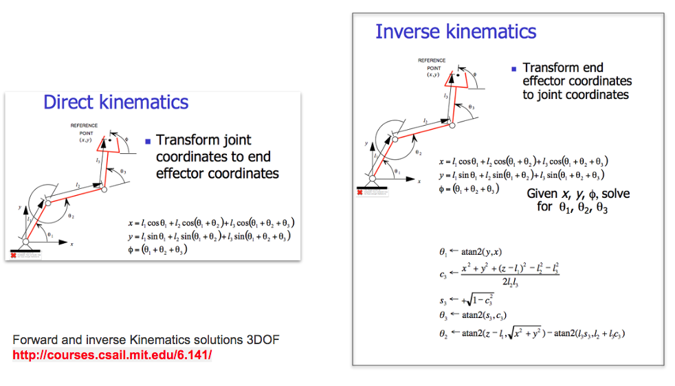

# TuDow2_Kinematics 土豆2號-仿生動力學
My Robot TuDow2 simulation w/ Kinematics    

羅拔特 是用QT5+OpenGL+QGLViewer 畫出來的！ 
茶壺位置(End Effector) 是用 __老歐的餘弦定理__ 算出來的！(2-DOF Forward/Inverse Kinematics) 
如果位置算錯了 那可能要叫他起來 說明白講清楚！！！  
 
Forward Kinematics Demo 
    
Inverse Kinematics Demo
    
 
  
 
 
### References
  - [libQGLViewer](http://libqglviewer.com/)
  - [QT GLWidget Teapot](https://github.com/WispProxy/OpenGL-Teapot-based-on-Qt-Cpp)
  - [Forward Kinematics, Arm Navigation](https://pythonrobotics.readthedocs.io/en/latest/modules/arm_navigation.html)
  - [Inverse Kinematics, Let’s write some Go to make it serve your five o’clock tea.](https://appliedgo.net/roboticarm/)
  - [Robot Inverse Kinematics](https://www.learnaboutrobots.com/inverseKinematics.htm)
  - [EECS/MIT 6.141: Robotics systems and science Lecture 14: Forward and Inverse Kinematics](https://www.academia.edu/9165706/Forward_and_inverse_Kinematics_complete_solutions_3DOF_good_reference_for_CrustCrawler_Smart_Arm_Users_)
  - [歐幾里德 餘弦定理 Law of Cosines](https://en.wikipedia.org/wiki/Law_of_cosines)
  
   
   

### Change Logs:
  - 0327 Upload
  
### To Do:
  - Add Inverse Kinematics
  - Add link to connect to Motor Controller
